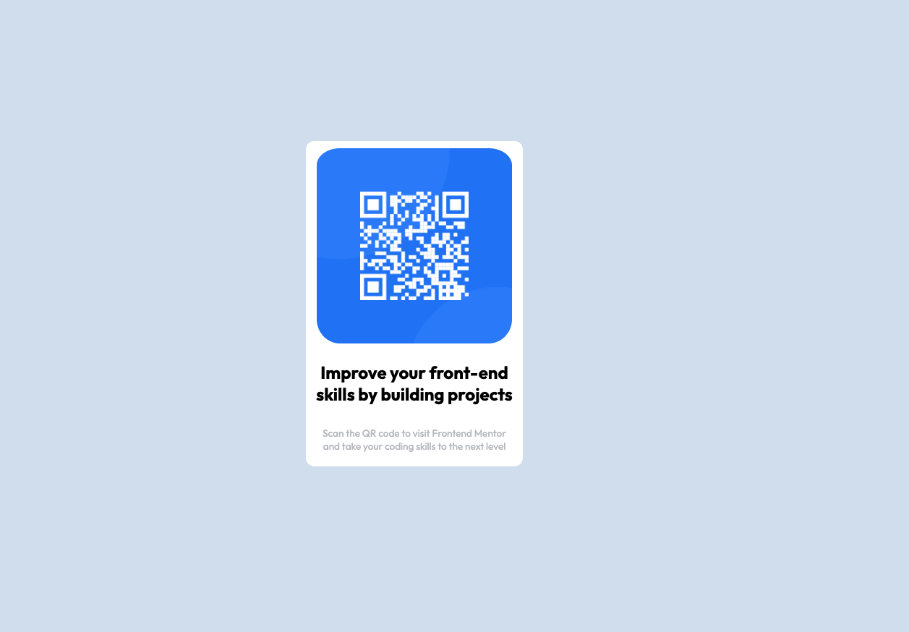

# Frontend Mentor - QR code component solution

This is a solution to the [QR code component challenge on Frontend Mentor](https://www.frontendmentor.io/challenges/qr-code-component-iux_sIO_H). Frontend Mentor challenges help you improve your coding skills by building realistic projects.

## Table of contents

- [Overview](#overview)
  - [Screenshot](#screenshot)
  - [Links](#links)
  - [Built with](#built-with)
  - [What I learned](#what-i-learned)
  - [Useful resources](#useful-resources)
- [Author](#author)

## Overview

### Screenshot

### Links

- Solution URL: [Add solution URL here](https://your-solution-url.com)
- Live Site URL: [Add live site URL here](https://your-live-site-url.com)

### Built with

- Semantic HTML5 markup
- CSS custom properties

### What I learned

I learned how to center an image inside a div -
- set the width of the image to a fixed amount (in px or %)

- set the display property to "block" - this way the browser will treat the image as a block element, allowing us to use the CSS margin property
- set the margin to auto (left and right)

### Useful resources

- [How to center an image inside a div](https://blog.hubspot.com/website/center-an-image-in-html#:~:text=Step%201%3A%20Wrap%20the%20image,to%20a%20fixed%20length%20value.) - Here is an article describing different solutions on how to center an image inside a div.

## Author

- [Ioana Negoita Tiu]
